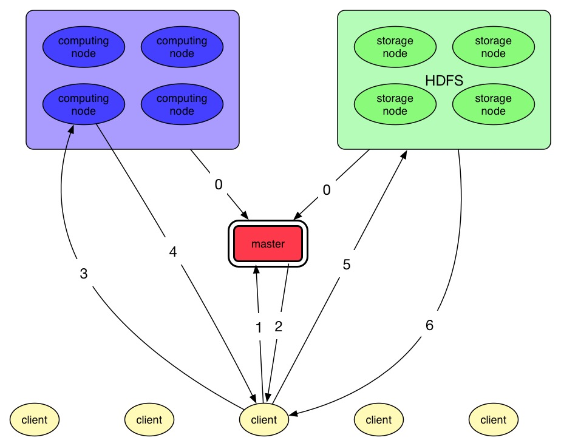
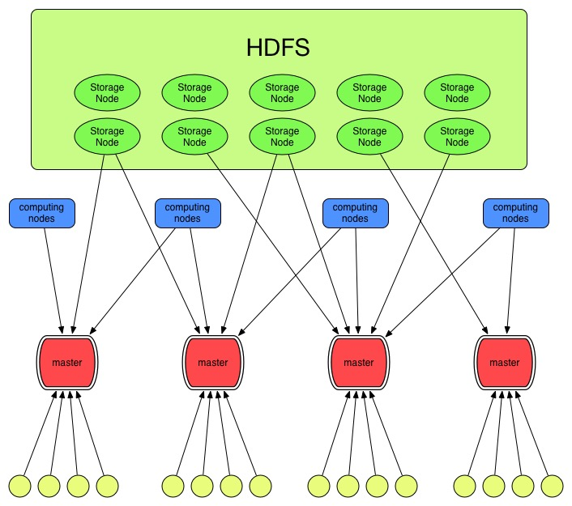

#Distributed Image Search Engine

This project is a distributed engine for keyword-based image search. It is constructed based on Hadoop and able to handle TBs of image data. The architecture of this project is highly scalable and can be decentralised. 

## How it works

There are four components in this system.

* storage nodes

  All storage nodes run on a HDFS which stores all images. Images are concatenated to be variable-sized blocks of up to 50GB. An image is uniquely identified by a triple of block number, offset and length. We call the triple *signature* of an image in later sections. 
  
  Each storage node runs one or more web servers which accept HTTP request contains image signatures. Web server extracts images from HDFS according to the signatures and send them in response.
    
* computing nodes
  
  Every computing node stores a copy of inverted index and runs a web server which accepts HTTP requests containing keywords. Computing node searches in inverted index and return signatures of images tagged with the keyword. 

* master node

  Master node manages all storage nodes and computing nodes. After receiving a HTTP request from web clients, it returns a HTTP response containing addresses of a computing node and several storage nodes.
These nodes are selected randomly so that the workload is evenly distributed. 

* web client

  Web client asks master node for addresses of computing node and storage nodes. Client doesn't communicate with the master node after getting the addresses. Keywords inputted by user is sent to the computing node which will returns image signatures. The client requests storage nodes for images with the signatures. 
  
  Requests to storage nodes are dynamically sent along with the progress of user's browsing. This greatly lightens workload of storage nodes.

This architecture can be easily decentralised by adding more master nodes. The system still works properly if one or more master nodes fail. 

## Acknowledgements

We wish to thank the following organizations or individuals, whose projects are included in ours.

* [jQuery JavaScript Library](https://jquery.com/) developed by jQuery Foundation, Inc.

* [Lazy Load](http://www.appelsiini.net/projects/lazyload) developed by Mika Tuupola

* [Semantic UI](http://semantic-ui.com/) developed by Semantic Organization

## License

Copyright (c) 2015 Jamis Hoo, Zichuan Lin, Zailong Li. See the LICENSE file for license rights and limitations (MIT).